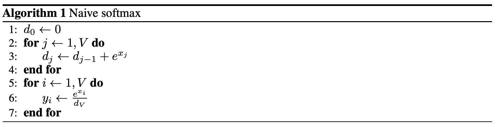
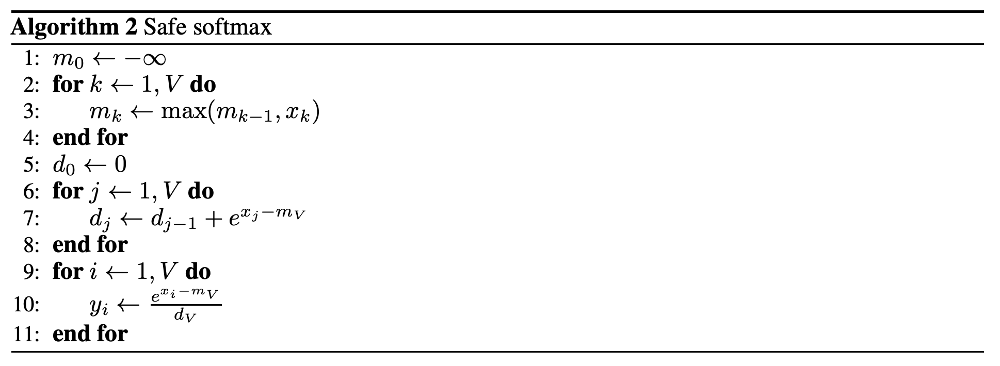
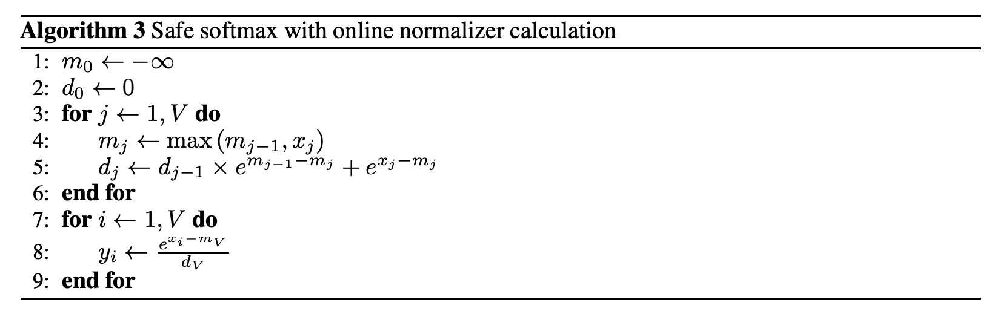

## Original softmax
$$
\sigma_i(\mathbf{z}) = \frac{e^{z_i}}{\sum^K_{j=1}e^{z_j}}
$$

Softmax의 수식은 위와 같다. 입력 벡터에 대해서 load 2번, store 1번, 총 3번의 메모리 접근이 필요하다. 이 함수의 의미는 주어진 값들 속에서 각각의 원소의 확률을 계산해준다. 유용한 함수이지만, 실제 컴퓨터상에서 구현하게 될 때는 부동소수점으로 인한 문제가 발생하기 쉽다. 부동소수점은 소수를 컴퓨터로 표현하는 방법인데, 중요한 점은 표현할 수 있는 범위가 한정된다는 것이다. 그런데 softmax 연산에는 지수함수($e^z$)의 특성으로 인해서 값이 아주 커진다. 이 값들의 합연산을 하면 overflow가 발생하기 쉽다. 또한 반대로 음수방향으로 생각하면 아주 작은 값으로 인해 $e^z$ 가 0에 가까워져버린다. 분모에 0이 들어가서 연산을 할 수 없는 오류가 발생해버리는 것. 

## Safe softmax
이 문제를 해결하기 위해서 수식을 약간 바꾸어 max값을 빼주게 되면 벡터는 0 이하의 값을 갖게 되어 범위가 좁아지게 된다. 또한 분모에는 최대값을 뺀 결과중 하나는 자기자신이기 때문에 $e^0=1$ 을 보장하게되어, 분모가 0이 되는 경우도 방지한다. 

$$
	\sigma_i(\mathbf{z}) = \frac{e^{z_i - \max(z)}}{\sum^K_{j=1}e^{z_j-\max(z)}}
$$

실제 하드웨어적 한계를 극복하면서도 수학적으로 동일한 결과이기 때문에 대부분은 safe softmax를 사용한다. 하지만 최대값 $m_k$ 를 구하는 과정이 추가되었기 때문에 메모리 접근이 4번으로 늘어나는 단점이 있다. 

## Online softmax calculation
메모리접근을 해결하는 방법이 `online softmax` 이다. Safe softmax 알고리즘을 살펴보면, 꼭 벡터의 max값이 필요한 것은 아니고 오버플로우를 방지할 정도의 큰 값이면 되는 것을 알 수 있다. 이 값은 Local max값으로부터 값을 갱신하면 된다. 

위 알고리즘의 분모 $d_V$ 를 구하는 방법은 점화식으로 나타낼 수 있다. 여기서 $e^m$ 항들은 지수법칙으로 빼낼 수 있음을 생각하자.

$$
\begin{aligned}
d_j &= \sum^j_{i=1}\left(e^{x_i-m_j}\right) \\
  &= \left(\sum^{j-1}_{i=1}e^{x_i-m_j}\right) + e^{x_j-m_j} \\
  &= \left(\sum^{j-1}_{i=1}e^{x_i-m_j }\right) + e^{x_j-m_j} \\
  &= \left(\sum^{j-1}_{i=1}e^{x_i-m_{j-1}}\right) \times e^{m_{j-1}-m_j} + e^{x_j-m_j} \\
  &= d_{j-1} \times e^{m_{j-1}-m_j} + e^{x_j-m_j}
\end{aligned}
$$

이 수식 전개를 통해서 local max 값을 이용하면서 분모 $d_V$ 를 같이 업데이트할 수 있게 되었다. 이 수식은 여전히 safe 할까? 기존의 값을 안정화하던 $m_j$ 는 여전히 해당 값을 처리할 때 안정성을 제공하여 overflow/underflow를 방지한다. $d_j$ 의 내부에서 $e^{x_i-m_j}$ 를 계산할 때, 지수항은 $x_i-m_j \le 0, e^{x_i-m_j} \le 1$ 을 만족하기 때문에, $d_j$ 는 1 이상 j 이하의 값을 갖기 때문에 안정적이다.

## References
1. [Online normalizer calculation for softmax](https://arxiv.org/abs/1805.02867)