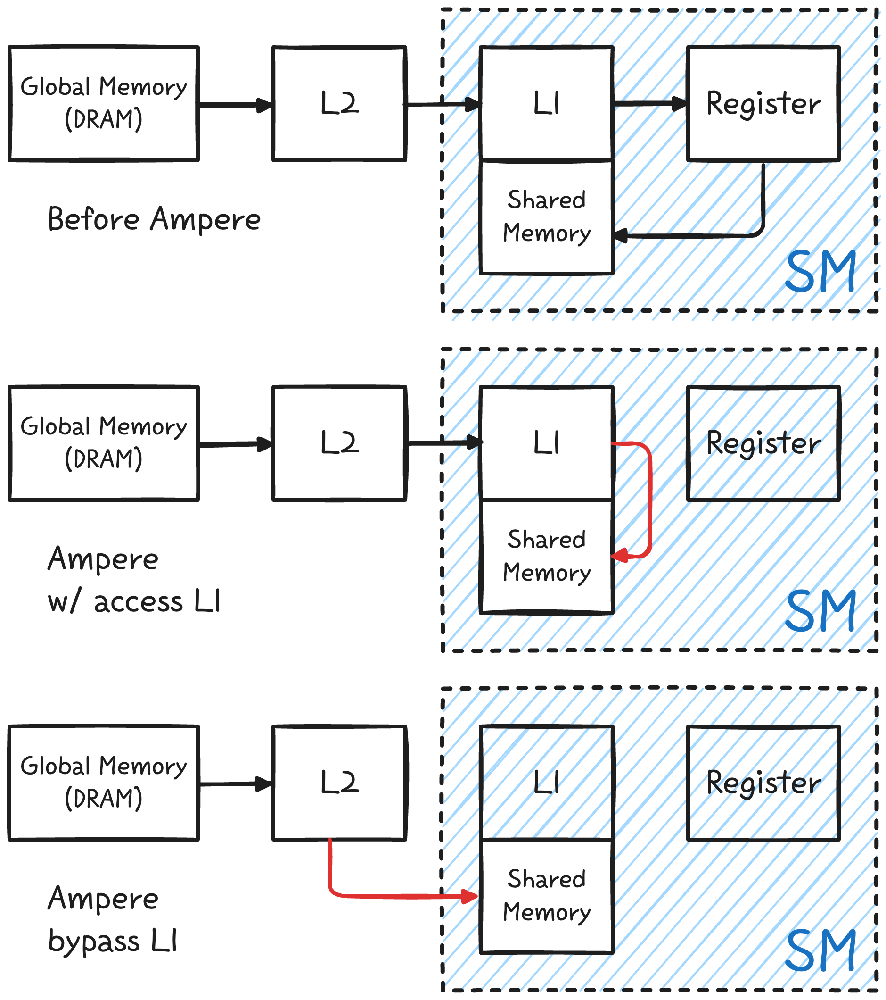
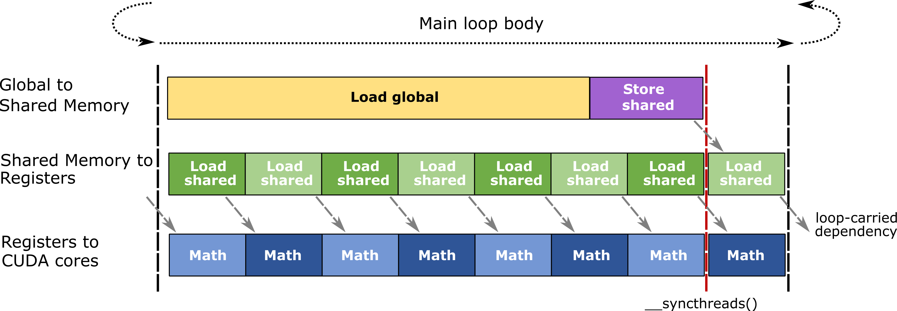
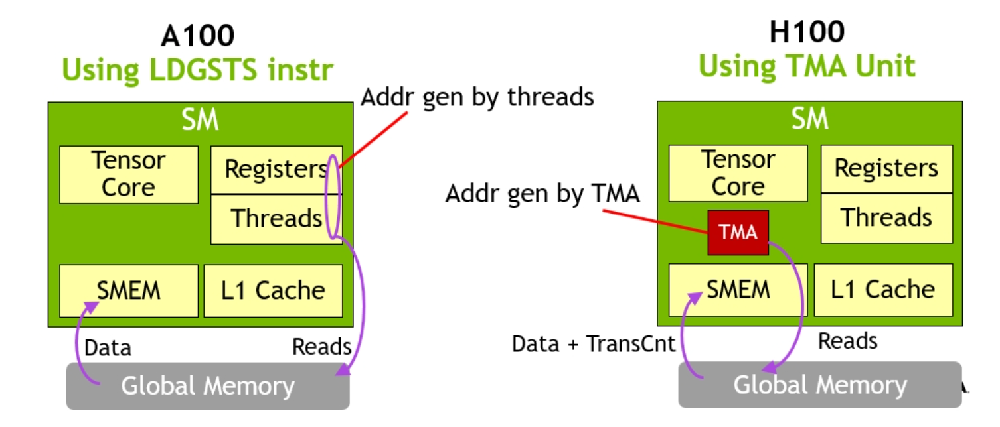

# GPU Architecture w/ LLM
GPU는 계속 세대가 발전했고, 그에 따라서 feature들이 바뀌었다. LLM을 다룰것이라면 Ampere 부터의 GPU의 하드웨어적 특성을 알면 좋다.
A100, H100 등 각 아키텍쳐의 대표적인 GPU를 통해 알아보자. 텐서코어의 TOPS 같은 성능수치는 다루지 않는다.

## A100: Ampere (SM80, 2020)
2020년 발표된 GPU로, L1 bypass를 통해서 많은 과정이 생략되면서 DRAM의 값을 Shared Memory (SRAM)에 불러오는 것이 최적화되었다. 

<p align="center">

</p>

`cp.async` ptx로 구성되는 이 메모리 복사는 비동기적으로 일어나기 때문에 다음과 같은 소프트웨어 파이프라인을 통해서 latency를 숨길 수 있다.

<p align="center">

</p>

소프트웨어 파이프라인은 연속된 명령어의 종속성을 제거해서 하드웨어를 fully utilize 하는 기법이다. 메모리 instruction LSU(Load Store Unit)에서 처리되고, 행렬곱은 연산장치(Tensor Core)에서 처리되므로, 하드웨어 종속성은 문제가 되지 않는다. 하지만 다음과 같은 데이터 종속성은 문제가 될 수 있다.

```cpp
for (i=0; i<N-1; i++) {
  load_to_register(i);
  compute(i);
}
```

`load_to_register(i)` 가 완료될 때까지 `compute(i)` 를 실행할 수 없다. load된 `i`의 데이터가 필요하기 때문이다. 따라서 파이프라인을 구성한다.

```cpp
load_to_register(0);
for (i=0; i<N-2; i++) {
  load_to_register(i+1);
  compute(i);
}
compute(N-1);
```

이렇게 하면 두 instruction 사이에 종속성이 제거되어 동시에 실행할 수 있다. 이 로직을 최대한 활용한 커널이 바로 `Flash-Attention-2`다. 저자의 말에 따르면 Ampere에서의 이론적 최대 성능에 근접한 값이라고 한다. 다른 포스트에서 설명하겠지만 mixed-precision gemm kernel `Marlin` 또한 최적화된 커널의 하나다.

## H100: Hopper (SM90, 2022)
2022년 GTC에서 발표된 Hopper 아키텍쳐이다. Ampere보다 훨씬 좋은 성능이다. 성능의 개선은 크게 TMA, WGMMA, Warp-Specialization 세가지를 다룬다. 미리 언급하면, H100의 feature를 활용한 커널에는 `Flash-Attention-3`, `Machete` 등이 있다.

### Tensor Memory Accelerator (TMA)
Ampere에서 L1 bypass를 통한 memory instruction의 성능 개선을 이루었다. 하지만 이를 위해서는 직접 메모리 주소와 stride 계산을 해주고 동기화에 관한 barrier까지 모두 관리해주어야했다. 그래서 NVIDIA는 여기에 만족하지 않고 TMA라는 유닛을 개발했다. TMA를 이용하면 텐서의 정보를 이용해서 대량의 데이터를 복사한다. 또한, 이 TMA instruction은 단일 스레드에서 launch되기 때문에 자원을 더욱 효율적으로 사용가능하다. 

<p align="center">

</p>

### Warp Group Matrix Multiply-Accumulate (WGMMA)
Ampere까지의 mma는 모두 단일 warp 기반 instruction이다. NVIDIA가 극한의 효율을 추구한 결과, 4개의 warp를 묶어서 mma를 처리하도록 만들었다.

### Warp Specialization: Consumer-Producer
이건 Hopper의 기능을 활용한 테크닉이다.Hopper는 각 warp가 사용할 register 개수를 지정해 줄 수 있게 되었다. 이 정보를 염두하고서 파이프라인을 살펴보면 1) memory 2) computation 의 두가지 큰 줄기가 있다. 당연히 memory instruction에서는 레지스터가 상대적으로 적게 필요할것이다. 분업에 따른 레지스터 차등분배는 다음과 같다.

- Produer warp group. TMA를 활용한 메모리 instruction 담당. 레지스터를 적게 가져도 충분함. 열심히 메모리를 불러옴.
- Consumer warp group. 텐서코어를 활용한 WGMMA isntruction 담당. 레지스터를 많이 가져가서 열심히 연산함.

## Blackwell (SM100, 2024)
2024 GTC에서 발표된 차세대 GPU. 이번에도 많은 것이 바뀌었다. 우선, WGMMA는 더이상 사용되지 않는다. Hopper 단일 아키텍쳐 지원 instruction이라니! 대신 UMMA가 생겼다. UMMA는 다음과 같은 입력 조건이 있다.

- Operand A: TMEM or SMEM
- Operand B: SMEM
- Accumulator: TMEM

<p align="center">

</p>

Tensor Memory (TMEM), TMEM이 무엇일까? Blackwell에서 새로 생긴 구조로, accumulator가 이곳에 있다는 것은 UMMA에서 데이터 처리를 위해 register가 필요하지 않음을 의미한다. 
뭐라고? 단일 스레드 실행에, 레지스터까지 필요없다고? TMA까지 활용하면 CTA(Cooperative Thread Array, 쉽게 말하면 CUDA kernel에서의 블록을 의미)에서 할 일은 전/후처리만 남는다. 

> 과거의 역사적 맥락에서 이러한 발전들은 범용 리소스를 다른 작업에 사용할 수 있도록, 연산들을 특수 하드웨어 리소스로 대체, 분리하는 추세임을 알 수 있겠다. 
> - Volta: Tensor Core로 행렬 연산을 일반 연산 파이프라인에서 분리
> - Ampere: async copy로 데이터 로딩과 계산을 동시에 수행, 진정한 파이프라인화
> - Hopper: TMA와 WGMMA로 데이터 이동과 MMA를 비동기, 저비용으로 겹쳐 실행
> - Blackwell: TMEM과 UMMA로 MMA 자체를 단일 스레드, 비동기로 처리해 레지스터 부담 제거

### Grace-Blackwell GB200
NVIDIA의 Grace CPU와 Blackwell GPU를 엮은 아키텍쳐. 위에서 이야기 한 것은 모두 GPU내부에서 일어나는 일들이다. 우리는 host(CPU)로부터 device(GPU)로 메모리를 복사해줄 필요가 있다. 어떻게? 기존에는 PCIe로.. 아 이게 많이 느리다. 그래서 NVLink로 둘을 붙였고, 그래서 Grace Blackwell이다. 당연히 PCIe보다 훨씬 빠를 것.

### Blackwell Geforce RTX 50 series (SM120, 2025)
Blackwell 기반의 Geforce GPU다. 참 비싼 가격이 요즘은 조금 내려온 것 같기도..? Blackwell 아키텍쳐지만 위에서 열심히 이야기한 TMEM이 없다. TMA는 있다. 그래서 LLM에 활용하려면 Ampere식 파이프라인에 TMA를 쓰는 정도일 듯 싶지만, 이걸 굳이 할 이유는 별로 없다. 물론 텐서코어 성능은 비교할 수 없이 좋아졌다.

## References
- [CUTLASS Tutorial: Efficient GEMM kernel designs with Pipelining](https://research.colfax-intl.com/cutlass-tutorial-design-of-a-gemm-kernel)
- [CUTLASS Tutorial: Writing GEMM Kernels Using Tensor Memory For NVIDIA® Blackwell GPUs](https://research.colfax-intl.com/cutlass-tutorial-writing-gemm-kernels-using-tensor-memory-for-nvidia-blackwell-gpus/)