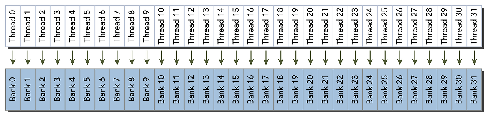
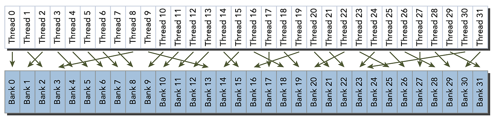
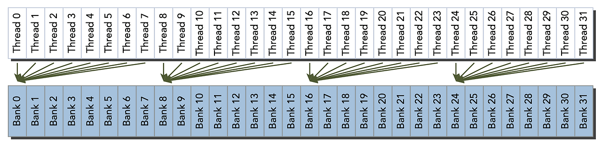
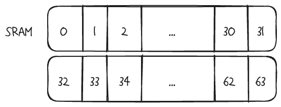
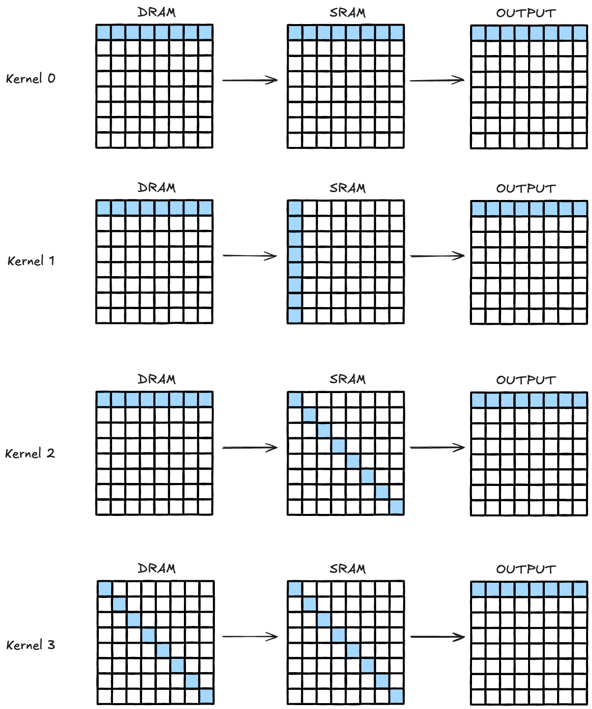
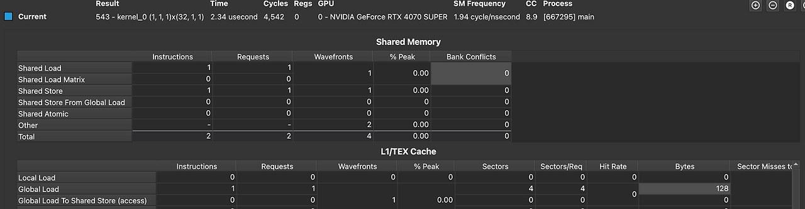
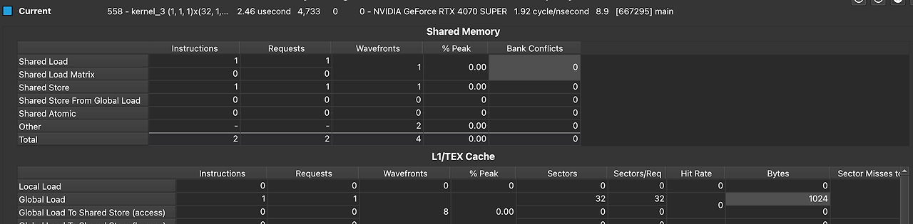

## Bank Conflicts
CUDA를 공부하면 Shared Memory를 공부하게 되고 그러면서 `Bank Conflicts`에 대해서도 다루게 된다. Bank Conflicts는 메모리 요청이 뱅크에 중복되게 일어날 때 발생하는 것을 나타낸다.

Shared memory는 32-bit 크기를 가진 메모리 모듈 32개로 이루어져있는데, 64개의 fp32 데이터를 SRAM에 넣으면 아래와 같이 들어가게 된다. 즉, 32개의 bank에 순차적으로 속하게 됩니다. 

각 스레드가 각각 다른 뱅크에 접근할 때(1, 2번)에는 bank conflict가 발생하지 않습니다. 3번 경우에는 bank conflicts가 "일어날 가능성이" 있는데, 정확하게는 두가지 경우를 생각해볼 필요가 있습니다.
-   스레드들이 같은 뱅크의 같은 주소에 접근할 때: 0-7번 스레드가 SRAM의 0번 데이터에 접근하는 경우를 나타냅니다. 이경우에는 broadcast access이므로, bank conflict가 일어나지 않습니다. 즉, 한 번의 memory request로 32개의 스레드가 데이터를 충족하게 됩니다. (memory request는 128바이트 단위라고 생각해주세요)
-   스레드들이 같은 뱅크의 다른 주소에 접근할 때: 0-3번 스레드는 SRAM의 0번 데이터에, 4-7번 스레드는 32번 데이터에 접근하는 경우를 나타냅니다. 이 경우에는 첫번째 메모리 요청에서 32번 주소의 데이터를 얻어올 수 없습니다. 왜냐하면 0번 뱅크는 앞선 요청에 따라 0번 데이터를 가지고 와야하거든요. 따라서 추가적인 메모리 요청이 필요하게 되고, 이게 성능저하를 야기시킵니다. 이런 경우가 바로 bank conflict를 나타냅니다.

## Experiment
실제로 그렇게 되는지 아래와 같은 4개의 커널을 실행해보겠습니다. 32x32의 행렬에 대한 연산을 편의상 그림에는 8x8로 나타내었습니다. 데이터는 Row-major로 저장되어있습니다. 

### Kernel 0: ideal case
0번 커널은 이상적인 케이스입니다. 32개의 스레드가 순차적으로 DRAM input의 0-31번 주소의 데이터에 접근, SRAM의 0-31번 주소에 데이터를 저장합니다. 그 후 다시 SRAM의 데이터를 그대로 불러서 DRAM output의 0-31번 주소에 저장합니다.

### Kernel 1: bank conflicts case
1번 커널은 bank conflict를 의도하는 코드입니다. DRAM에서 데이터를 로드해서, 일부러 SRAM의 0번 뱅크에 모든 데이터를 처리합니다. 결과 31번의 bank conflict가 발생해서 32개의 wavefront가 발생합니다. wavefront는 직렬화되어 처리됩니다.

### Kernel 2: good case
2번 커널은 각자 다른 뱅크에, 인접하지 않은 데이터에 접근합니다. 그래도 괜찮습니다. 어짜피 각 메모리 컨트롤러는 자신에게 할당된 데이터를 독립적으로 가져올 거라서 성능적 손실은 발생하지 않습니다. 다만, 실제 상황에서는 사용하기 어려운 인덱싱이겠으니.. good case입니다.

### Kernel 3: DRAM load overhead case
이 케이스는 DRAM에서 memory coalescing이 중요하다는 것을 보여드리려고 가져왔습니다. 2번 커널과 비슷하지만, DRAM에서 데이터를 읽어들일 때, 각자 다른 sector에 담겨있는 데이터를 가져옵니다. 기존 DRAM에서는 4바이트x32=128바이트의 데이터, 즉 4개의 섹터만 로드하면 되었는데, 이 커널에서는 한 섹터당 4바이트밖에 유효하지 않습니다. 다행히(?) 떨어져있는 데이터라도 4개의 섹터를 한번에 처리할 수 있어서 wavefront는 8개만 발생했네요. 그래도 결국 128바이트의 데이터를 부르기 위해서 1024바이트의 데이터를 읽어오는 성능 저하가 발생했습니다.

## 결론
4개의 커널로 살펴보았듯, CUDA 프로그래밍에 있어서 중요한 부분은 어떻게 데이터를 일괄적으로 처리할 것인지 입니다. 데이터 layout을 바꾸어서 load하면 성능 손실을 막을 수 있겠죠.
## How about fp64?
번외로, SRAM bank size는 4KB인데 fp64의 데이터는 어떻게 동작하게 될까요? Aligned&coalesced memory access를 전제로 했을 때, 이 경우에는 메모리 컨트롤러가 request를 128바이트씩 2개의 transaction으로 쪼개서 수행하게끔 디자인되어있다고 합니다. 그래서 bank conflict가 발생하지 않는다고 하네요.
## References
1.  [https://forums.developer.nvidia.com/t/requesting-clarification-for-shared-memory-bank-conflicts-and-shared-memory-access/268574/3](https://forums.developer.nvidia.com/t/requesting-clarification-for-shared-memory-bank-conflicts-and-shared-memory-access/268574/3 "sd")