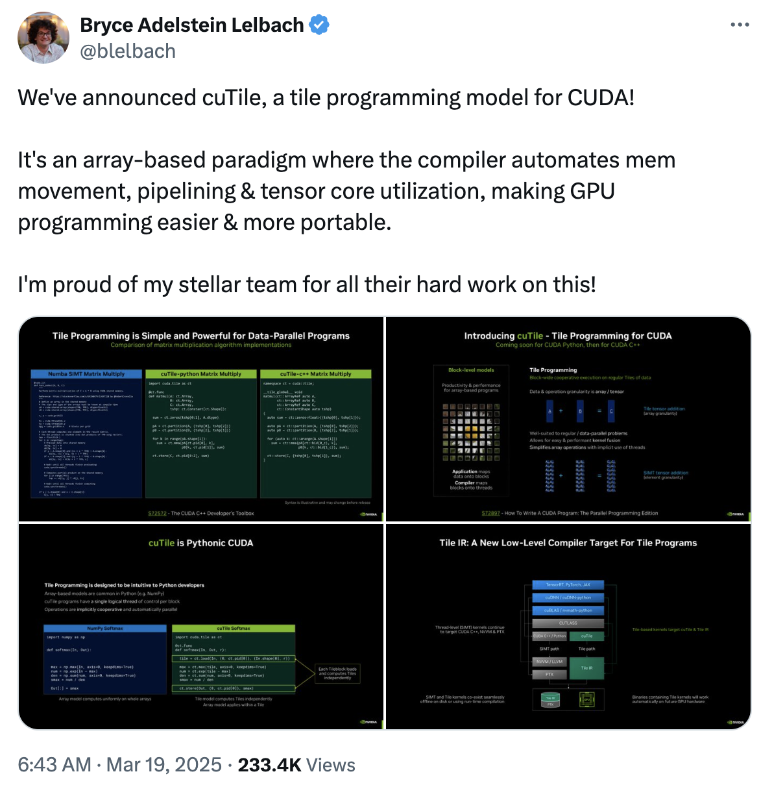
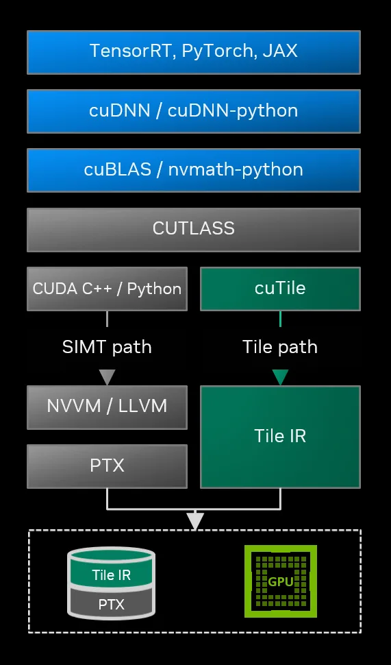

## Until now 
기존의 CUDA 프로그래밍은 CUDA C++을 바탕으로 하고 있었다. SIMT 기반으로 데이터를 블록과 스레드에 맵핑해줄 필요가 있다. 세밀한 설계를 통해 최선의 성능을 이끌어 낼 수 있으나, 모두가 손쉽게 할 수 있지는 않은 일이다. 또한 GPU 아키텍쳐가 발전함에 따라서 하드웨어 스펙도 달라지니 커널 개발자는 각 GPU에 맞는 최선의 커널을 다르게 개발해야했다. 

이런 어려움에 대해 떠오른 것이 triton-language다([NVIDIA Triton Inference Server와는 관계가 없다](https://github.com/triton-lang/triton/issues/156)). Triton은 메모리관리, 동기화, 텐서코어 스케쥴링 등 블록 레벨의 추상화를 통해 접근성을 높였다. 이에 더해 MLIR을 통해 NVIDIA GPU뿐 아니라 AMD, NPU 등 다양한 하드웨어 백엔드로 이어질 수 있는 수단으로 확장된 추세이다.

물론 NVIDIA에서도 이런 어려움을 극복하기 위한 CUTLASS와 같은 라이브러리를 제공한다. 작은 타일 레벨의 operation들을 템플릿화해서 최적의 커널을 비교적 손쉽게 개발할 수 있다. FlashAttention-3도 CUTLASS 기반으로 작성되었다. 하지만 비교적 쉬운게, 진짜 쉬운건 아니다. 수많은 템플릿과 로직을 알고 있어야했다. 이 또한 결국 CUDA C++을 알아야한다.

## CUDA Tile IR
그러던 와중 2025년 봄에 발표된 내용. NVIDIA에서 타일 기반의 프로그래밍 모델을 개발한다는 소식이다. 언제 공개되나 기다렸는데 25년이 다 가기전에 공개했다.

<p align="center">

</p>

cuTile은 기존 SIMT 기반 프로그래밍 모델과 같은 레벨에 머무른다. 이야기는 즉슨 CUDA C++ 코드 개발 -> PTX -> CUBIN 으로 이어지던 패스에 더해서 Tile IR -> CUBIN 으로 이어지는 패스가 추가된 것이다.

<p align="center">

</p>

Tile IR은 MLIR Dialect 기반으로 구성될 예정이고, bytecode로 저장된다고 한다. 직접 Tile IR를 건드리는 부분을 개발할 것이 아니라면 cuTile Python을 사용하면 된다.

- **NVIDIA cuTile Python**: 대부분의 개발자는 여기에 해당된다. CUDA Tile IR을 백엔드로 사용하는 Python 구현체이다.
- **CUDA Tile IR**: 자체 DSL 컴파일러 또는 라이브러리를 개발하려는 개발자는 CUDA Tile IR을 사용한다. 

## cuTile Python: how-to install
개발 환경은 공식문서에서 가지고 왔다.
- Linux x86_64, Linux aarch64 or Windows x86_64
- A GPU with compute capability 10.x or 12.x
- NVIDIA Driver r580 or later
- CUDA Toolkit 13.1 or later
- Python version 3.10, 3.11, 3.12 or 3.13

환경이 구성되었다면, pip으로 설치하자.
torch 또한 환경에 맞춰서 설치하면 된다.

```bash
pip install cuda-tile

pip install cupy-cuda13x  # For sample
pip install pytest numpy  # For stest
```


