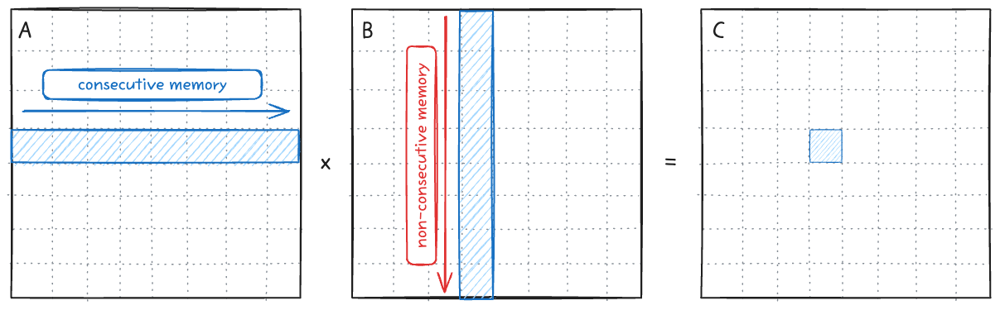
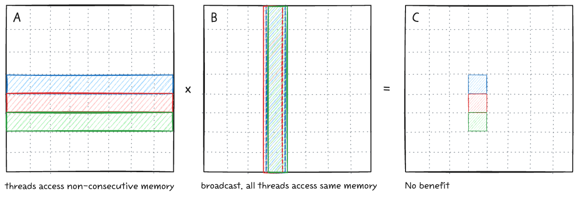
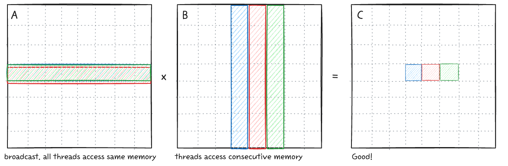
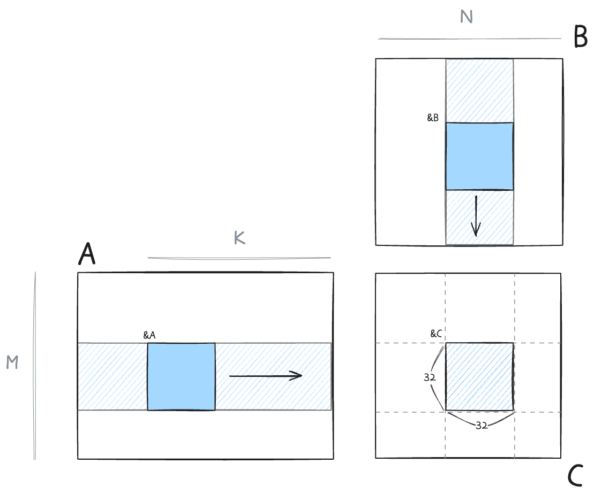
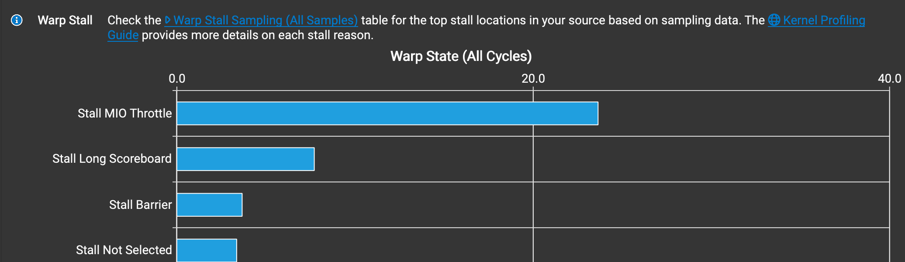

이 글은 [포스트](https://siboehm.com/articles/22/CUDA-MMM)를  참고하며 직접 커널과 그림을 작성하며 진행한 공부이다.

CUDA는 cuBLAS에서 최적화된 GEMM api를 제공한다. 이론적으로, 직접 커널을 작성하여 cuBLAS 급의 성능을 낼 수 있다. 이 과정에서 CUDA의 최적화 개념들을 하나씩 적용하면서 따라가보자. 우선, 편의성을 위해, 아래와 같이 설정한다. 

- A: (M, K), row-major
- B: (K, N), row-major
- C: (M, N), row-major
- DRAM: Global memory
- SRAM: Shared memory

구현은 다음과 같고, 결과를 먼저 보이면 아래와 같다.

0. Naive implementation
1. DRAM coalescing
2. SRAM caching
3. SRAM 1d tiling

```
Matrix dimensions: M=1024, N=1024, K=1024
[BENCHMARK]                       CPU_GEMM │ 261.327484 ms (w:10 r:20)
[BENCHMARK]                    CUBLAS GEMM │ 0.046322 ms (w:10 r:20)
[BENCHMARK]               GPU GEMM 0 NAIVE │ 2.584720 ms (w:10 r:20)
[BENCHMARK]   GPU GEMM 1 MEMORY COALESCING │ 0.371920 ms (w:10 r:20)
[BENCHMARK]                GPU GEMM 2 SMEM │ 0.247920 ms (w:10 r:20)
[BENCHMARK]           GPU GEMM 3 1D TILING │ 0.101456 ms (w:10 r:20)
```

## 0. Naive implementation
가장 기본형태의 연산은 다음과 같다. 한개의 스레드가 다음 연산을 진행하는데, row-major라서 B의 불연속적인 메모리를 읽어오는 단점이 있다.

<p align="center">

</p>

아래의 그림은 warp-level에서의 GEMM operation을 나타낸다. Loop 구조상, A를 load할 때 스레드들은 비연속적인 메모리에 접근한다. Memory coalescing이 불가능하다. B를 load할 때는 모든 스레드가 같은 값에 접근하기 때문에 warp 내의 broadcast가 동작한다. 하지만 결과적으로 보면 이 스레드들을 하나의 워프로 묶는건 이점이 없다.

<p align="center">

</p>

## 1. DRAM coalescing
따라서 아래와 같은 구조로 변경한다. A를 읽어올때는 한 번의 memory load 로 필요한 모든 데이터가 올라간다. B(0, k) 의 값을 load할때, 인접한 연속적인 메모리를 한번에 불러오므로 memory coalescing이 가능하다.

<p align="center">

</p>

이 기본 커널은 다음 형태와 같다. _편의상 warp내에서는 항상 A matrix의 같은 row를 접근하게끔 행렬을 구성하였다._

```cpp
// Naive GEMM implementation in GPU
__global__ void gemm_gpu_0_bad(int *A, int *B, int *C, int M, int N, int K) {
  int m = blockIdx.x * blockDim.x + threadIdx.x;
  int n = blockIdx.y * blockDim.y + threadIdx.y;
  if (n >= N || m >= M)
    return;

  int sum = 0;
  for (int k = 0; k < K; k++) {
    sum += A[m * K + k] * B[k * N + n];
  }

  C[m * N + n] = sum;
}

__global__ void gemm_gpu_0_good(int *A, int *B, int *C, int M, int N, int K) {
  int m = blockIdx.y * blockDim.y + threadIdx.y;
  int n = blockIdx.x * blockDim.x + threadIdx.x;
  if (n >= N || m >= M)
    return;

  int sum = 0;
  for (int k = 0; k < K; k++) {
    sum += A[m * K + k] * B[k * N + n];
  }

  C[m * N + n] = sum;
}
```

RTX 5090에서 실행한 결과는 다음과 같다. dram을 읽어오는 것에 대한 결과인데 `bad` 커널은 현저하게 낮은 성능을 보인다.

```bash
$ sudo /usr/local/cuda/bin/ncu --metrics dram__bytes.sum.per_second a.out  
  gemm_gpu_0_bad(int *, int *, int *, int, int, int) (32, 32, 1)x(32, 32, 1), Context 1, Stream 7, Device 0, CC 12.0
    Section: Command line profiler metrics
    -------------------------- ----------- ------------
    Metric Name                Metric Unit Metric Value
    -------------------------- ----------- ------------
    dram__bytes.sum.per_second     Gbyte/s         2.25
    -------------------------- ----------- ------------

  gemm_gpu_0_good(int *, int *, int *, int, int, int) (32, 32, 1)x(32, 32, 1), Context 1, Stream 7, Device 0, CC 12.0
    Section: Command line profiler metrics
    -------------------------- ----------- ------------
    Metric Name                Metric Unit Metric Value
    -------------------------- ----------- ------------
    dram__bytes.sum.per_second     Gbyte/s        17.67
    -------------------------- ----------- ------------
```

## 2. SRAM caching
Naive 구현체는 데이터를 반복해서 가져와야하는데, DRAM에서 여러번 가져오는 것은 성능적 손실이 크다. [Paper](https://arxiv.org/abs/1804.06826)에 따르면 V100 기준으로 DRAM bandwidth는 900 GB/s, SRAM bandwidth는 13,800 GB/s 이다 (SRAM bandwidth는 공식적으로 수치가 알려져있지는 않다). 

따라서 SRAM에 올려두고 최대한 재사용해야하는 것이다. 이 단계의 커널에서는 아래 그림과 같이 small block을 정의해서 데이터를 처리하도록 한다.

<p align="center">

</p>

```cuda
__global__ void gemm_gpu_1(float *A, float *B, float *C, int M, int N, int K) {
  A += blockIdx.y * blockDim.y * K; // (bM,0)
  B += blockIdx.x * blockDim.x;     // (0,bN)
  C += blockIdx.y * blockDim.y * N + 
	   blockIdx.x * blockDim.x; // (bM,bN)

  __shared__ float A_shared[BLOCKSIZE * BLOCKSIZE];
  __shared__ float B_shared[BLOCKSIZE * BLOCKSIZE];

  float sum = 0;
  for (int bkIdx = 0; bkIdx < K; bkIdx += BLOCKSIZE) {
    A_shared[threadIdx.y * blockDim.x + threadIdx.x] = A[threadIdx.y * K + threadIdx.x];
    B_shared[threadIdx.y * blockDim.x + threadIdx.x] = B[threadIdx.y * N + threadIdx.x];
    __syncthreads();
    
    A += BLOCKSIZE;
    B += BLOCKSIZE * N;

    for (int dotIdx = 0; dotIdx < BLOCKSIZE; dotIdx++)
    {
      sum += A_shared[threadIdx.y*BLOCKSIZE + dotIdx] * 
	        B_shared[dotIdx*BLOCKSIZE + threadIdx.x];
    }

    __syncthreads();
  }
  C[threadIdx.y*N + threadIdx.x] = sum;
}
```

## 3. SRAM 1D tiling
SRAM caching을 활용함으로써 성능이 향상되었지만 여전히 cuBLAS의 커널에 비해서는 부족하다. 단순하게 1개의 스레드가 1개의 결과를 만들어내는 `SRAM caching` 커널의 메모리 접근 패턴을 보면 다음과 같다.  즉, C 행렬 원소 한 개의 결과값을 만들기 위해서는 `K/16 DRAM`, `K*2 SRAM` 만큼의 메모리 접근이 필요한 것이다.

- DRAM: K/32 iterations of outer loop * 2 loads
- SRAM: K/32 iterations of outer loop * BLOCKSIZE (=32) * 2 loads
- Memory accesses per result: K / 16 DRAM, K * 2 SRAM

프로파일링 결과를 보면 MIO (Memory Input/Output) 에서 warp stall이 발생하고, 이로 인해 성능이 저하됨을 알 수 있다.

<p align="center">

</p>

이 문제는 동일한 메모리를 재활용하는 것으로 해결이 가능하다. 1개의 스레드가 8개의 element의 output을 만들어내게끔 타일링을 하면 다음과 같다.

<p align="center">

</p>

Warp 내에서 하나의 스레드는 column 방향으로 C matrix의 8개의 원소를 계산하게 구현하고, 이를 바탕으로 아까의 메모리 식을 다시 계산해보면,

- DRAM: K/8 iters (dotIdx) loop * 2 loads
- SRAM: K/8 iters (dotIdx) loop * BK(=8) * (1 + TM(=8))
- Memory accesses per result: K/32 DRAM, K * 9/8 SRAM

 `K/16 -> K/32 DRAM`, `K*2 -> K*9/8 SRAM` 으로, 결과 한개당 메모리접근이 줄어들게 된다.

```cuda
 for (int bkIdx = 0; bkIdx < K; bkIdx += BK) {
    A_shared[innerRowA * BK + innerColA] = A[innerRowA * K + innerColA];
    B_shared[innerRowB * BN + innerColB] = B[innerRowB * N + innerColB];
    __syncthreads();

    A += BK;
    B += BK * N;

    for (int dotIdx = 0; dotIdx < BK; dotIdx++) {
      float _b = B_shared[dotIdx * BN + threadCol];
      for (int resIdx = 0; resIdx < TM; resIdx++) {
        threadResults[resIdx] +=
            A_shared[(threadRow * TM + resIdx) * BK + dotIdx] * _b;
      }
    }
    __syncthreads();
  }
```


## References
- [How to Optimize a CUDA Matmul Kernel for cuBLAS-like Performance: a Worklog](https://siboehm.com/articles/22/CUDA-MMM)