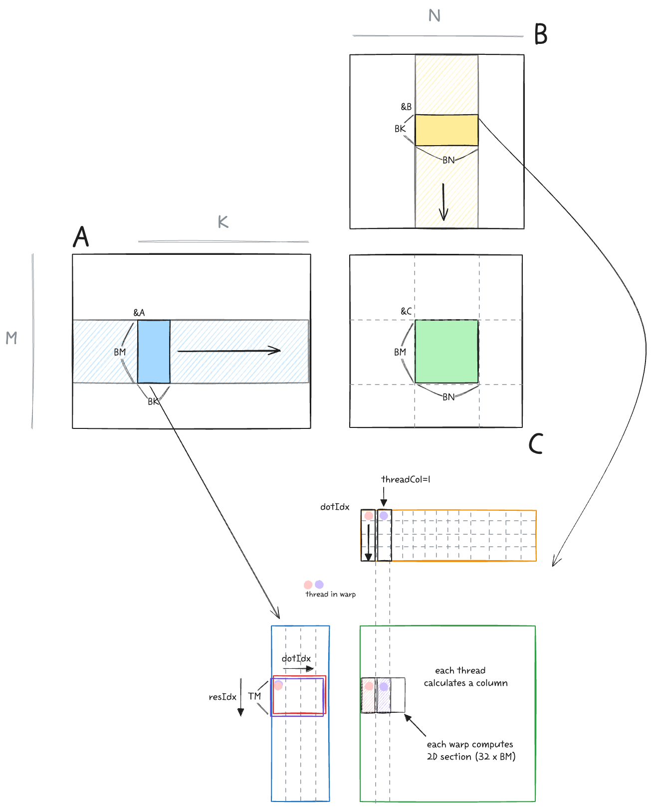
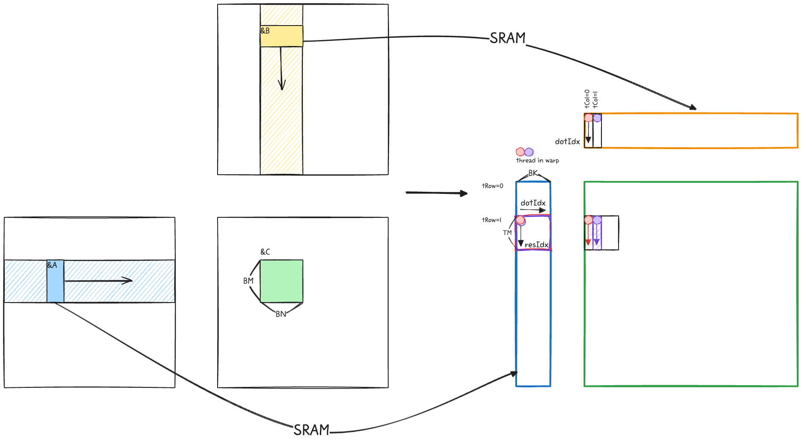
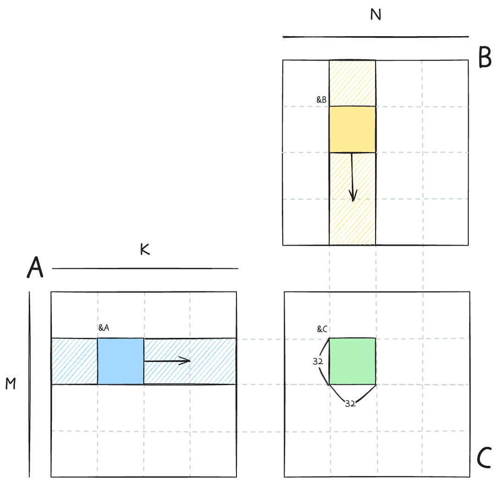
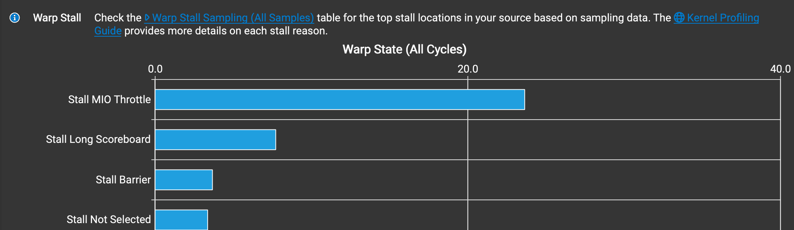

이 글은 [포스트](https://siboehm.com/articles/22/CUDA-MMM)를  참고하며 직접 커널과 그림을 작성하며 진행한 공부이다.

CUDA는 cuBLAS에서 최적화된 GEMM api를 제공한다. 직접 작성한 커널도 최적화를 통해서 충분히 cuBLAS 급의 성능을 낼 수 있다. 단계적으로 CUDA의 최적화 개념들을 적용하면서 따라가보자.

- A: (M, K), row-major
- B: (K, N), row-major
- C: (M, N), row-major
- DRAM: Global memory
- SRAM: Shared memory

구현은 다음과 같고, 결과를 먼저 보이면 아래와 같다.

0. Naive implementation, DRAM coalescing
1. SRAM caching
2. SRAM 1d tiling

```
[BENCHMARK]                    CUBLAS GEMM │ 0.045334 ms (w:10 r:20)
[BENCHMARK]               GPU GEMM 0 NAIVE │ 3.943722 ms (w:10 r:20) [PASSED]
[BENCHMARK]     GPU GEMM 0 DRAM COALESCING │ 0.517949 ms (w:10 r:20) [PASSED]
[BENCHMARK]        GPU GEMM 1 SRAM CACHING │ 0.248670 ms (w:10 r:20) [PASSED]
[BENCHMARK]      GPU GEMM 2 SRAM 1D TILING │ 0.249046 ms (w:10 r:20) [PASSED]
```

## 0. Naive implementation

<p align="center">

</p>

가장 기본형태의 연산은 다음과 같이 한개의 스레드가 C의 한 element를 계산하기 위한 연산을 진행하는 것이다. Row-major이기 때문에 B를 load할 때 불연속적인 메모리를 읽어오는 단점이 있다. 이 동작을 warp-level에서의 GEMM operation을 나타내면 아래 그림과 같다.

<p align="center">

</p>

Loop 구조상 A를 load할 때 스레드들은 비연속적인 column 메모리에 접근하기에 memory coalescing이 불가능하다. Memory coalescing이 불가능하면 결국 warp 내에서 load operation이 32번 발생하게 되고, 이는 성능 크나큰 성능 저하를 가져온다. 

B를 load할 때는 모든 스레드가 같은 값에 접근하기 때문에 warp 내의 broadcast가 동작한다. 하지만 결과적으로 보면 이 스레드들을 하나의 워프로 묶는건 이점이 없다.

### DRAM coalescing

<p align="center">

</p>

위와 같이 연속적인 메모리를 접근하여서 워프의 이점을 살려야한다. A를 load할때는 memory load - broadcast를 통해서 필요한 모든 데이터가 채워진다. B의 값을 load할때 warp내에서는 인접한 연속적인 메모리를 한번에 불러오므로 memory coalescing이 가능하다.

```cuda
__global__ void gemm_gpu_0_naive(int M, int N, int K, float alpha, float *A, float *B, float beta, float *C)
{
  int tid = blockIdx.x * blockDim.x + threadIdx.x;
  int row = tid % N;
  int col = tid / N;
 ...
}

__global__ void gemm_gpu_0_dram_coalescing(int M, int N, int K, float alpha, float *A, float *B, float beta, float *C)
{
  int tid = blockIdx.x * blockDim.x + threadIdx.x;
  int row = tid / N;
  int col = tid % N;
  ...
}
```

두 커널의 코드 차이는 row, col의 계산방식 뿐이지만 실제 성능은 큰 차이가 난다. 프로파일링의 결과를 보면 성능 차이가 DRAM operation에서 발생하는 것을 확인할 수 있다.

```bash
# RTX 5090
$ sudo /usr/local/cuda/bin/ncu --metrics dram__bytes.sum.per_second gemm
  gemm_gpu_0_naive(int, int, int, float, float *, float *, float, float *) (4096, 1, 1)x(256, 1, 1), Context 1, Stream 7, Device 0, CC 12.0
    Section: Command line profiler metrics
    -------------------------- ----------- ------------
    Metric Name                Metric Unit Metric Value
    -------------------------- ----------- ------------
    dram__bytes.sum.per_second     Gbyte/s         2.40
    -------------------------- ----------- ------------

  gemm_gpu_0_dram_coalescing(int, int, int, float, float *, float *, float, float *) (4096, 1, 1)x(256, 1, 1), Context 1, Stream 7, Device 0, CC 12.0
    Section: Command line profiler metrics
    -------------------------- ----------- ------------
    Metric Name                Metric Unit Metric Value
    -------------------------- ----------- ------------
    dram__bytes.sum.per_second     Gbyte/s        18.07
    -------------------------- ----------- ------------
```

## 1. SRAM caching
Naive 구현체는 데이터를 반복해서 가져와야하는데, DRAM에서 여러번 가져오는 것은 성능적 손실이 크다. [Paper](https://arxiv.org/abs/1804.06826)에 따르면 V100 기준으로 DRAM bandwidth는 900 GB/s, SRAM bandwidth는 13,800 GB/s 이다 (SRAM bandwidth는 공식적으로 수치가 알려져있지는 않다). SRAM을 활용, 메모리를 최대한 재사용해서 성능을 올려보자. 

<p align="center">

</p>

각 블록은 32x32 크기를 가지고 C의 결과값을 하나씩 담당해서 연산을 한다. 각 블록에서 필요로 하는 DRAM의 메모리는 위 그림의 빗금친 영역이다. bkIdx loop를 통해서 SRAM에 store할 영역으로 이동하고, tIter loop를 통해서 SRAM load - gemm 연산을 수행한다. 1 result per thread 이므로 결과값은 단일 변수 `sum` 에 누적해서 최종적으로 DRAM C에 저장한다.

```cuda
template <int BLOCKSIZE>
__global__ void gemm_gpu_1_sram_caching(int M, int N, int K, float alpha, float *A, float *B, float beta, float *C)
{
    int bkRow = blockIdx.y;
    int bkCol = blockIdx.x;

    A += K * BLOCKSIZE * bkRow;
    B += BLOCKSIZE * bkCol;
    C += N * BLOCKSIZE * bkRow + BLOCKSIZE * bkCol;

    __shared__ float sA[BLOCKSIZE * BLOCKSIZE];
    __shared__ float sB[BLOCKSIZE * BLOCKSIZE];

    int tRow = threadIdx.x / BLOCKSIZE;
    int tCol = threadIdx.x % BLOCKSIZE;

    float sum = 0.0f;
    for (int bkIdx = 0; bkIdx < K; bkIdx += BLOCKSIZE)
    {
        sA[threadIdx.x] = A[tRow * K + tCol];
        sB[threadIdx.x] = B[tRow * N + tCol];
        __syncthreads();

        A += BLOCKSIZE;
        B += BLOCKSIZE * N;
        
        for (int tIter = 0; tIter < BLOCKSIZE; tIter++)
        {
            sum += sA[tRow * BLOCKSIZE + tIter] * sB[tIter * BLOCKSIZE + tCol];
        }
        __syncthreads();
    }

    C[tRow * N + tCol] = alpha * sum + beta * C[tRow * N + tCol];
}
```

## 2. SRAM 1D tiling
SRAM caching을 활용함으로써 성능이 향상되었지만 여전히 cuBLAS의 커널에 비해서는 부족하다. 단순하게 1개의 스레드가 1개의 결과를 만들어내는 `SRAM caching` 커널의 메모리 접근 패턴을 보면 다음과 같다.  즉, C 행렬 원소 한 개의 결과값을 만들기 위해서는 `K/16 DRAM`, `K*2 SRAM` 만큼의 메모리 접근이 필요한 것이다.

- DRAM: K/32 iterations of outer loop * 2 loads
- SRAM: K/32 iterations of outer loop * BLOCKSIZE (=32) * 2 loads
- Memory accesses per result: K / 16 DRAM, K * 2 SRAM

프로파일링 결과를 보면 MIO (Memory Input/Output) 에서 warp stall이 발생하고, 이로 인해 성능이 저하됨을 알 수 있다.

<p align="center">

</p>

이 문제는 동일한 메모리를 재활용하는 것으로 해결이 가능하다. 1개의 스레드가 8개의 element의 output을 만들어내게끔 타일링을 하면 다음과 같다.

<p align="center">

</p>

Warp 내에서 하나의 스레드는 column 방향으로 C matrix의 8개의 원소를 계산하게 구현하고, 이를 바탕으로 아까의 메모리 식을 다시 계산해보면,

- DRAM: K/8 iters (dotIdx) loop * 2 loads
- SRAM: K/8 iters (dotIdx) loop * BK(=8) * (1 + TM(=8))
- Memory accesses per result: K/32 DRAM, K * 9/8 SRAM

 `K/16 -> K/32 DRAM`, `K*2 -> K*9/8 SRAM` 으로, 결과 한개당 메모리접근이 줄어들게 된다.

```cuda
for (int bkIdx = 0; bkIdx < K; bkIdx += BK)
{
    sA[innerRowA * BK + innerColA] = A[innerRowA * K + innerColA];
    sB[innerRowB * BN + innerColB] = B[innerRowB * N + innerRowB];
    __syncthreads();

    A += BK;
    B += BK * N;

    for (int dotIdx = 0; dotIdx < BK; dotIdx++)
    {
        float _b = sB[dotIdx * BN + tCol];
        for (int resIdx = 0; resIdx < TM; resIdx++)
        {
            sum[resIdx] += sA[(tRow * TM + resIdx) * BK + dotIdx] * _b;
        }
    }
    __syncthreads();
}
```

이 커널에서는 BM와 TM의 사이즈가 동일해야 한다. 한 블록의 스레드 개수는 (BM*BN/TM)개인데, 이 스레드 개수와 sA, sB의 사이즈가 동일해야 DRAM->SRAM 을 손쉽게 수행할 수 있기 때문이다.

```cuda 
sA[innerRowA * BK + innerColA] = A[innerRowA * K + innerColA];
sB[innerRowB * BN + innerColB] = B[innerRowB * N + innerRowB];
```

## References
- [How to Optimize a CUDA Matmul Kernel for cuBLAS-like Performance: a Worklog](https://siboehm.com/articles/22/CUDA-MMM)