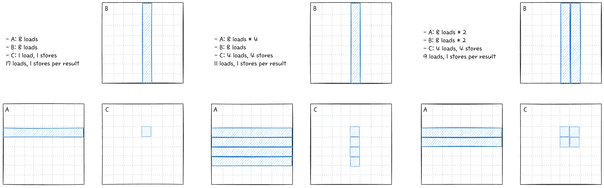
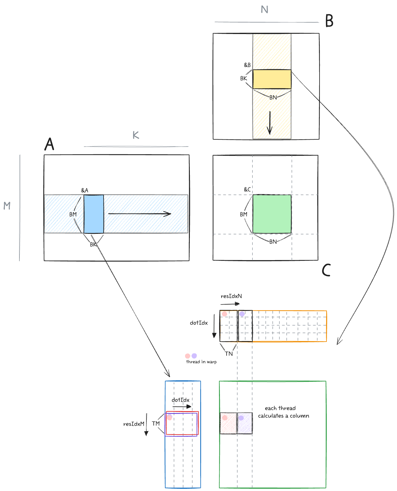

## Arithmetic Intensity (AI)
Arithmetic intensity, 산술강도는 연산량/메모리량, ops/byte(mem) 으로 나타낸다. 즉 AI가 높을수록 동일한 메모리로 더 많은 연산을 할 수 있음을 의미한다. 이전 챕터에서는 SRAM (Shared memory of CUDA), 1d tiling 을 활용해서 성능을 끌어올렸다. 한개의 스레드에서 아래와 같이 여러개의 결과를 만들어낸다. 살펴본 경우와 더불어 확장된 알고리즘의 AI를 생각해보자.

<p align="center">

</p>

앞서 살펴본 커널에서, 한개의 결과만 만들어내는 경우는 17 load 가 필요하다. 반면 1d tiling을 하는것만으로도 11 load 로 줄어들게 되는데, 2d tiling을 하게 되면 9 load로 그보다 더 줄어든다. 이는 GEMM 연산의 특징으로 메모리를 재사용하는 방향으로 최적화를 더 진행해야됨을 알 수 있다.

## 4. SRAM 2d tilling
2d tiling이 더욱 효과적인 것을 알았으니 이제 구현해보자. `TN` 변수를 추가해서 loop를 확장한다.

<p align="center">

</p>

```cuda
  int totalResultsBlocktile = BM * BN;  // 128*128=16384
  int numThreadsBlocktile = totalResultsBlocktile / (TM * TN);  // 16384/(8*8)=256
  int strideA = numThreadsBlocktile / BK;  // 256/8=32

  for (int bkIdx = 0; bkIdx < K; bkIdx += BK) {
    for (int offset = 0; offset < BM; offset += strideA) {
      A_shared[(innerRowA + offset) * BK + innerColA] =
          A[(innerRowA + offset) * K + innerColA];
    }
    for (int offset = 0; offset < BK; offset += strideB) {
      B_shared[(innerRowB + offset) * BN + innerColB] =
          B[(innerRowB + offset) * N + innerColB];
    }
    __syncthreads();

    A += BK;
    B += BK * N;

    for (int dotIdx = 0; dotIdx < BK; dotIdx++) {
      for (int i = 0; i < TM; i++) {
        regM[i] = A_shared[(threadRow * TM + i) * BK + dotIdx];
      }
      for (int i = 0; i < TN; i++) {
        regN[i] = B_shared[dotIdx * BN + threadCol * TN + i];
      }
      for (int resIdxM = 0; resIdxM < TM; resIdxM++) {
        for (int resIdxN = 0; resIdxN < TN; resIdxN++) {
          threadResults[resIdxM * TN + resIdxN] +=
              regM[resIdxM] * regN[resIdxN];
        }
      }
    }
    __syncthreads();
  }
```

BM=BN=128, BK=TM=TN=8로 아래와 같이 커널을 실행시킨다. 한 블록당 스레드는 256개이다.
```cuda
template <int BM, int BN, int BK, int TM, int TN>
void launch_gpu_kernel_4(float *A, float *B, float *C, int M, int N, int K) {
  dim3 block((BM * BN) / (TM * TN));
  dim3 grid(ceil_div(N, BN), ceil_div(M, BM));
  gemm_gpu_4_sram_2d_tiling<BM, BN, BK, TM, TN>
      <<<grid, block>>>(A, B, C, M, N, K);
}
```

이렇게 하고 다시 메모리를 확인하면, 성능이 향상됨을 알 수 있다.
- DRAM: K/8 iters * 2 (=A+B) * 4 (=sizeSRAM/numThreads) loads
- SRAM: K/8 iters * 8 (=dotIdx) * 2 (=A+B) * 8 (=TM,=TN) loads
- Memory accesses per result: K/64 DRAM, K/4 SRAM

