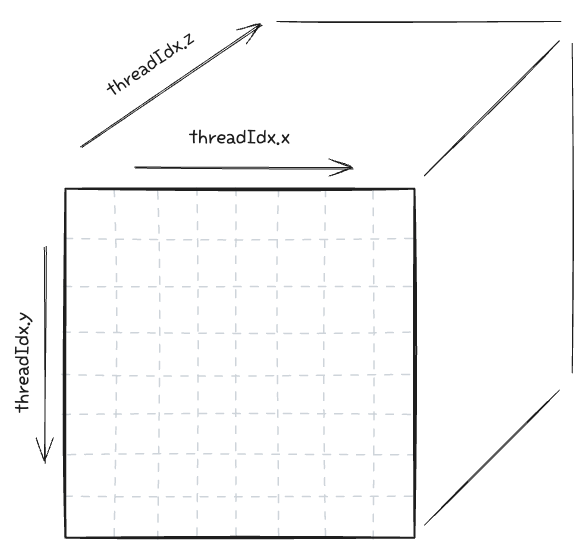
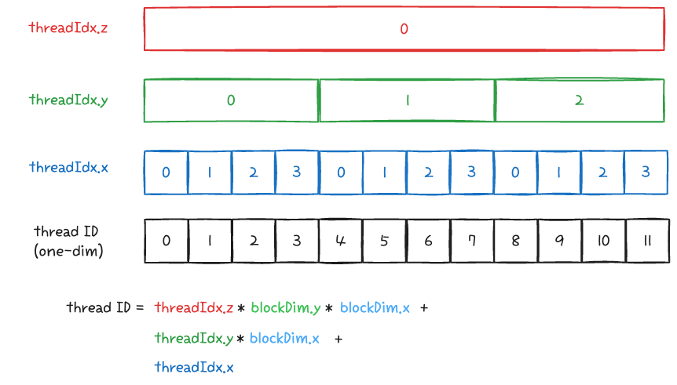
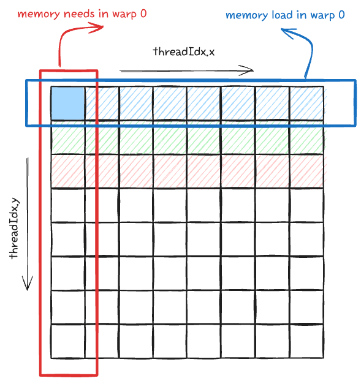

## Proper Thread Indexing and Memory Coalescing
CUDA는 아래 그림과 같은 Grid - Block - Thread 의 논리적 계층구조를 사용한다. 블록 내부의 thread 는 3차원으로 구성할 수 있는데, 결론을 먼저 말하면 별다른 메모리 구조를 가지지 않는 한, _스레드 인덱스 (x, y, z) 는  (x + y Dx + z Dx Dy) 로 계산하라_ 이다. 왜 그런지 알아보자.

<p align="center">

</p>

이때, xyz dimension 순서를 마음대로 바꿔도 성능에 영향이 없을까? 답은 **NO** 다. [CUDA Programming guide](https://docs.nvidia.com/cuda/cuda-c-programming-guide/#thread-hierarchy) 에 나와있는 내용으로, 블록을 3차원으로 했을때의 id는 다음과 같이 계산된다. 

<p align="center">

</p>

이걸 무시했을 때 실제 커널에서 어떤 영향을 끼치는지 알아보자. 다음과 같은 커널 두개가 있다고 생각해보자. 1024개 원소의 vector 2개를 더하고 output에 저장하는, 2 memory load and 1 save 연산이다. 
1) `kernel_0`: index를 x-y 순으로 계산
2) `kernel_1`: index를 y-x 순으로 계산
```cuda
__global__ void kernel_0(int* d_vec_a, int* d_vec_b, int* output, int size) {
	int index = threadIdx.x * blockDim.y + threadIdx.y;
	output[index] = d_vec_a[index] + d_vec_b[index];
}

__global__ void kernel_0(int* d_vec_a, int* d_vec_b, int* output, int size) {
	int index = threadIdx.y * blockDim.x + threadIdx.x;
	output[index] = d_vec_a[index] + d_vec_b[index];
}
```
논리 스레드를 각각 알맞는 메모리 주소에 매핑해줬기 때문에 두 커널의 연산 결과는 동일하다. 하지만 결과는 다르다. kernel_0 이 더 오래 걸린다. 
```
kernel_0 mean time: 0.0052768 ms
kernel_1 mean time: 0.0028352 ms
```
이렇게 되는 이유는 CUDA thread가 warp-level로 instruction이 발생하기 때문이다. 한 개의 워프에서 memory load request가 발생하면, DRAM에서 연속된 128바이트를 온다. 하지만 필요한 데이터는 한개뿐이 없다. 쉽게 말하면 row-major matrix에서 col-major address 접근을 하고 있는것과 비슷하다는 말이다. 당연히 uncoalesced memory access로 인해 성능이 저하된다.

<p align="center">

</p>
